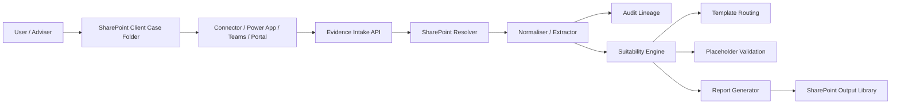

# SharePoint Client File Evidence Design

## Objective
Enable advisers and operations users to generate a suitability report from documents already held in a client case file in SharePoint, without re-uploading documents manually.

---

## Preferred user experience
1. A user opens a client case in SharePoint.
2. The user chooses **Generate suitability report** or selects relevant files/folders.
3. The integration sends the SharePoint document references to `evidence.intake`.
4. The platform retrieves the files securely, normalises the evidence, and stores lineage.
5. `suitability.engine` orchestrates routing, validation, and report generation.
6. The generated report is written back to an approved SharePoint output location.

---

## Scope
### In scope
- Reading source documents from SharePoint client files/folders
- Selecting one file, multiple files, or a whole case folder
- Normalising supported document types into canonical evidence
- Maintaining audit lineage and evidence integrity
- Using Managed Identity / Microsoft Graph for access

### Out of scope
- Free-text editing of client evidence inside the app
- Direct template authoring in SharePoint
- Replacing governance or approval controls

---

## Proposed architecture



### Core components
#### 1. SharePoint document selector
A thin UI or connector lets the user:
- provide a `CaseId`
- select a SharePoint folder or files
- submit the selection for processing

This can be implemented as:
- a **Power App** embedded in SharePoint
- a **Teams tab / message extension**
- a **Power Automate flow** triggered from SharePoint
- a lightweight internal web UI

#### 2. `evidence.intake` enhancement
The existing `IntakeEvidence` endpoint becomes the ingestion entry point for SharePoint references.

**Current endpoint:**
- `POST /api/evidence/intake`

**Design extension:** accept source metadata such as:
- `sourceType = "sharepoint"`
- `siteId`
- `driveId`
- `itemId` or folder path
- `webUrl`
- `includeChildren`
- selected document types

#### 3. SharePoint resolver service
A new resolver inside `evidence.intake` reads the referenced documents using **Microsoft Graph** with **Managed Identity**.

Responsibilities:
- validate the case folder/file exists
- enumerate files within a selected folder
- download file content/metadata
- capture immutable identifiers and hashes
- reject unsupported or oversized files

#### 4. Evidence normalisation
Convert files into a canonical evidence model used by the engine.

Supported first-wave formats:
- `pdf`
- `docx`
- `xlsx`
- `txt`
- optionally `eml` / `msg`

Normalised output should include:
- `caseId`
- file name and type
- SharePoint source reference
- extracted text or structured fields
- hash / content fingerprint
- ingestion timestamp

#### 5. Suitability orchestration
Once evidence is normalised, the existing flow continues:
- `template.routing`
- `placeholder.validation`
- `report.generator`
- `audit.lineage`

---

## API design

### Request example
```json
{
  "caseId": "CASE-2026-00123",
  "evidenceType": "client-case-documents",
  "source": "sharepoint",
  "sourceType": "sharepoint-folder",
  "sharePoint": {
    "siteId": "contoso.sharepoint.com,site-id,web-id",
    "driveId": "b!abc123",
    "itemId": "01ABCDEF...",
    "webUrl": "https://tenant.sharepoint.com/sites/clients/ClientA/CASE-2026-00123",
    "includeChildren": true
  },
  "options": {
    "allowedExtensions": ["pdf", "docx", "xlsx"],
    "maxFileCount": 25,
    "maxFileSizeMb": 25
  }
}
```

### Response example
```json
{
  "operation": "evidence.intake",
  "correlationId": "<guid>",
  "status": "Accepted"
}
```

---

## Security and compliance controls

### Access model
- Use **system-assigned or user-assigned Managed Identity** for Azure Functions
- Use **Microsoft Graph application permissions** with **Sites.Selected** where possible
- Grant access only to the approved SharePoint sites/libraries used for client case files

### Mandatory controls
- no SharePoint credentials in source control
- no long-lived secrets in client apps
- log every intake event to `audit.lineage`
- store source `siteId/driveId/itemId/webUrl` for reconstruction
- hash each file at ingestion time
- fail closed if the SharePoint reference or permissions are missing
- optionally run malware/DLP scanning before normalisation

### Data minimisation
- ingest only files selected by the user or located in the governed case folder
- avoid copying entire libraries
- retain references + normalised evidence, not unnecessary duplicates

---

## SharePoint integration patterns

### Pattern A: Whole case folder ingestion (**preferred**)
User selects the case folder once; the system processes the folder contents.

**Pros**
- simplest user journey
- consistent case-level lineage
- easier reconstruction

**Cons**
- requires folder discipline and naming controls

### Pattern B: Selected files ingestion
User selects specific documents within the case file.

**Pros**
- tighter control over what is included
- good for partial cases

**Cons**
- more user effort
- higher risk of omission

### Recommendation
Use **Pattern A by default** and allow **Pattern B** as an override.

---

## Operational flow
1. User starts generation from the SharePoint case folder.
2. Connector sends case reference + SharePoint identifiers to `evidence.intake`.
3. `evidence.intake` validates the request and resolves documents via Graph.
4. Files are downloaded, hashed, and normalised.
5. A lineage record is emitted for each source document.
6. `suitability.engine` pulls the normalised case evidence and evaluates suitability.
7. Generated report is stored in the governed SharePoint output location.
8. Result links and evidence bundle references are returned to the user.

---

## Required implementation additions

### Application changes
- extend `EvidenceIntakeRequest` to carry SharePoint references
- add `ISharePointCaseEvidenceStore` / `ISharePointResolver`
- add file extraction and normalisation pipeline
- persist normalised evidence by `CaseId`
- ensure `suitability.engine` reads the normalised case package

### Configuration
- `SHAREPOINT_TENANT_ID`
- `SHAREPOINT_SITE_ID` or approved site allowlist
- `SHAREPOINT_CLIENT_CASE_DRIVE_ID`
- `REPORT_OUTPUT_ROOT_URL`
- managed identity Graph permissions

### Governance
- approved case library structure
- permitted file types and sizes
- retention and deletion rules
- evidence provenance and audit reporting

---

## Suggested rollout

### Phase 1: Controlled MVP
- one approved SharePoint site
- one case folder pattern
- read-only ingestion of PDF/DOCX
- manual user-triggered intake

### Phase 2: Production hardening
- folder selection UI
- DLP/AV scanning
- better metadata extraction
- retries, throttling, and error handling

### Phase 3: Full operating model
- Power Automate / SharePoint action integration
- automatic case refresh when new evidence lands
- richer evidence classification and MI reporting

---

## Success criteria
- user can generate a report from a SharePoint-held case file without manual re-upload
- every ingested document is attributable to a SharePoint source reference
- evidence integrity is provable via stored hash and lineage
- protected APIs remain secured while the user workflow remains simple
- the generated report is written back to the approved SharePoint destination

---

## Recommendation
Implement the feature by making `evidence.intake` the controlled ingestion gateway for **SharePoint case folder references**, not by letting the report engine read SharePoint directly. This keeps the design aligned with the current service boundaries:

- `evidence.intake` = retrieve + normalise + prove provenance
- `suitability.engine` = orchestrate evaluation
- `report.generator` = create output
- `audit.lineage` = evidential traceability
